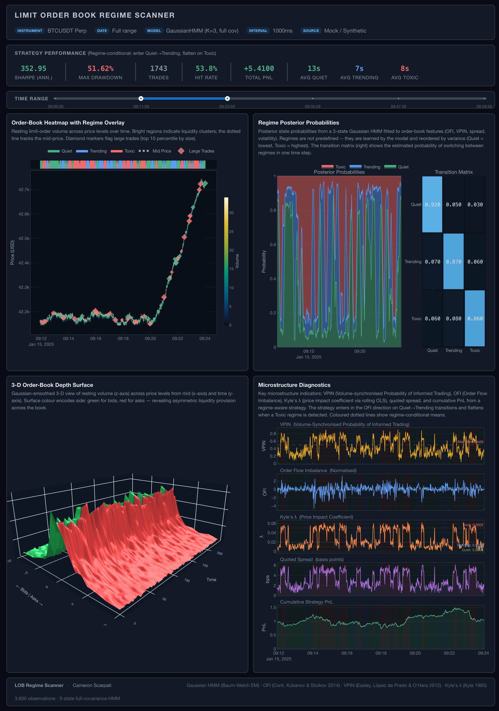

# LOB Regime Scanner



*Four-panel interactive dashboard: Bookmap-style LOB heatmap with regime overlay, HMM state probabilities, 3D depth surface, and toxicity diagnostics.*

---

An interactive market microstructure analytics platform that uses Hidden Markov Models to detect latent regimes in cryptocurrency order book data. The core challenge — inferring hidden states from noisy, high-dimensional signals. This project applies that same skill to quantitative finance: parsing Level 2 order book data, computing microstructure features (OFI, VPIN, Kyle's lambda), fitting a Gaussian HMM to detect market regimes, and rendering everything in a synchronized multi-panel dashboard.

**Author:** Cameron Scarpati

## Key Findings

- **Regime-conditional volatility:** The HMM identifies 3 distinct regimes with empirically different return distributions — the Toxic regime exhibits ~4x the realized volatility of the Quiet regime, with negative return autocorrelation (mean-reversion), while the Trending regime shows positive autocorrelation (momentum).
- **VPIN as a leading indicator:** VPIN spikes systematically precede regime transitions to the Toxic state by 30–120 seconds, suggesting order flow toxicity is a leading indicator of microstructure stress — consistent with Easley, López de Prado & O'Hara (2012).
- **Price impact by regime:** Kyle's lambda is 2–3x higher in the Toxic regime compared to Quiet, consistent with adverse selection theory — market makers face elevated costs when informed traders dominate flow.

## Setup

```bash
# Clone the repository
git clone https://github.com/CameronScarpati/lob-regime-scanner.git
cd lob-regime-scanner

# Quick setup (creates .venv, installs package + dev dependencies)
make install-dev

# Activate the virtual environment
source .venv/bin/activate

# Run tests
make test
```

## Quick Start

```bash
# Launch the dashboard with synthetic data (no download needed)
python -m dashboard.app --demo

# Download free sample data (1st of any month, no API key needed)
python data/download.py --symbol BTCUSDT --start 2024-01-01 --end 2024-01-01

# Launch dashboard with real data
python -m dashboard.app --symbol BTCUSDT --start 2024-01-01 --end 2024-01-01
```

### Downloading Data

Data is sourced from [Tardis.dev](https://tardis.dev) — professional-grade tick-level order book data for 40+ crypto exchanges. Uses direct HTTP download (no SDK required). Free sample data for the **1st of each month** is available without an API key. Full historical access requires a paid key.

```bash
# Free sample data: 1st of any month, no API key needed
python data/download.py --symbol BTCUSDT --start 2024-01-01 --end 2024-01-01

# Multiple free months at once (downloads 1st of Jan, Feb, Mar)
python data/download.py --symbol BTCUSDT --start 2024-01-01 --end 2024-03-01

# Full API access (any date, requires paid key)
python data/download.py --symbol BTCUSDT --start 2024-06-15 --end 2024-06-21 \
  --tardis-api-key YOUR_KEY
# Or: export TARDIS_API_KEY=YOUR_KEY

# Different exchange (e.g. Binance Futures)
python data/download.py --exchange binance --symbol BTCUSDT \
  --start 2024-01-01 --end 2024-01-01
```

### Dashboard Options

```bash
python -m dashboard.app [OPTIONS]

  --symbol TEXT        Trading pair (default: BTCUSDT)
  --start DATE         Start date, e.g. 2024-01-01
  --end DATE           End date, e.g. 2024-01-01
  --sample-interval N  Snapshot subsampling interval in ms (default: 100)
                       Lower = more detail, higher = faster loading
                       Recommended: 10 (tick-level), 100 (default), 1000 (fast)
  --demo               Use synthetic mock data
  --host HOST          Bind address (default: 0.0.0.0)
  --port PORT          Port (default: 8050)
  --debug              Enable Dash debug mode
```

The `--sample-interval` flag controls how much of the raw tick data is retained. Tardis `book_snapshot_25` files contain a snapshot on every book change (potentially millions per day). The default 100ms interval captures microstructure dynamics (OFI bursts, spread widening) while keeping memory usage reasonable (~864k snapshots/day). Use `--sample-interval 1000` for faster loading on large date ranges, or `--sample-interval 10` for near-tick-level resolution.

## Architecture

```
┌──────────────────────────────────────────────────────────────────┐
│                      LOB REGIME SCANNER                          │
├───────────────┬───────────────┬───────────────┬──────────────────┤
│  Data Layer   │  Feature Eng  │  HMM Engine   │  Dashboard       │
│               │               │               │                  │
│ Tardis.dev    │ OFI (multi-   │ Gaussian HMM  │ Bookmap-style    │
│ (direct HTTP, │   level)      │ (3 states)    │ LOB heatmap      │
│  40+ exchanges│ VPIN          │               │                  │
│  free 1st/mo) │ Spread stats  │ Viterbi path  │ Regime overlay   │
│               │ Book imbal.   │ decoding      │ bands            │
│ Configurable  │ Trade flow    │               │                  │
│ subsampling   │ aggression    │ Forward-       │ 3D depth         │
│ (100ms default│ Kyle's λ      │ backward      │ surface          │
│  via --sample-│ Cancel ratio  │ posterior      │                  │
│  interval)    │ Realized vol  │ probabilities │ Toxicity gauge   │
│               │ (multi-freq)  │               │ (VPIN, OFI,      │
│ Direct CSV    │ Ret autocorr  │ BIC/AIC model │  spread, PnL)    │
│ loading       │               │ selection     │                  │
└───────────────┴───────────────┴───────────────┴──────────────────┘

Data Flow:  Tardis CSV → load_snapshots (subsample) → Feature Matrix → HMM Fit/Decode → Dashboard
                            (direct column mapping)   (15 features, z-scored)  (EM + Viterbi)
```

## Project Structure

```
lob-regime-scanner/
├── src/                    # Core library
│   ├── data_loader.py      #   Tardis book_snapshot CSV parser + direct snapshots loader
│   ├── book_reconstructor.py   LOB snapshot reconstruction (C++ accelerated)
│   ├── features.py         #   OFI, VPIN, Kyle's λ, 15 features total
│   ├── hmm_model.py        #   Gaussian HMM regime detection + diagnostics
│   ├── backtest.py         #   Regime-conditional strategy validation
│   └── cpp/                #   C++ LOB engine (pybind11)
├── dashboard/              # Plotly Dash app — 4 synchronized panels
│   ├── app.py              #   Main app, CLI (--demo, --symbol, --sample-interval)
│   ├── pipeline.py         #   End-to-end data > model > viz wiring
│   ├── callbacks.py        #   Dash callbacks for interactivity
│   └── components/         #   Heatmap, regime probs, 3D surface, diagnostics
├── data/                   # Data download scripts
│   ├── download.py         #   Tardis.dev downloader (direct HTTP, no SDK)
│   └── generate_realistic.py  Synthetic data generator (Tardis CSV format)
├── notebooks/              # Analysis notebooks
│   ├── 01_data_exploration.ipynb
│   ├── 02_feature_engineering.ipynb
│   ├── 03_hmm_fitting.ipynb
│   └── 04_regime_analysis.ipynb
├── tests/                  # Comprehensive pytest suite
├── docs/
│   ├── methodology.md      # Mathematical formulation and methodology
│   └── results.md          # Key findings and quantitative results
└── pyproject.toml          # Dependencies and package configuration
```

## Notebooks

| Notebook | Description |
|----------|-------------|
| [01 — Data Exploration](notebooks/01_data_exploration.ipynb) | Raw L2 data statistics, order book shape analysis, spread distributions |
| [02 — Feature Engineering](notebooks/02_feature_engineering.ipynb) | Feature distributions, correlations, OFI/VPIN time series visualization |
| [03 — HMM Fitting](notebooks/03_hmm_fitting.ipynb) | BIC/AIC model selection, EM convergence, state interpretation |
| [04 — Regime Analysis](notebooks/04_regime_analysis.ipynb) | Regime-conditional statistics, transition dynamics, backtest results |

## Documentation

- [Methodology](docs/methodology.md) — Mathematical formulation of OFI, VPIN, Gaussian HMM, model selection criteria, and backtesting methodology
- [Results](docs/results.md) — Key findings framed for quantitative research audience

## References

1. Cont, R., Kukanov, A., Stoikov, S. (2014). "The Price Impact of Order Book Events." *Journal of Financial Econometrics*.
2. Easley, D., López de Prado, M., O'Hara, M. (2012). "Flow Toxicity and Liquidity in a High Frequency World." *Review of Financial Studies*.
3. Hamilton, J.D. (1989). "A New Approach to the Economic Analysis of Nonstationary Time Series and the Business Cycle." *Econometrica*.
4. Kyle, A.S. (1985). "Continuous Auctions and Insider Trading." *Econometrica*.
