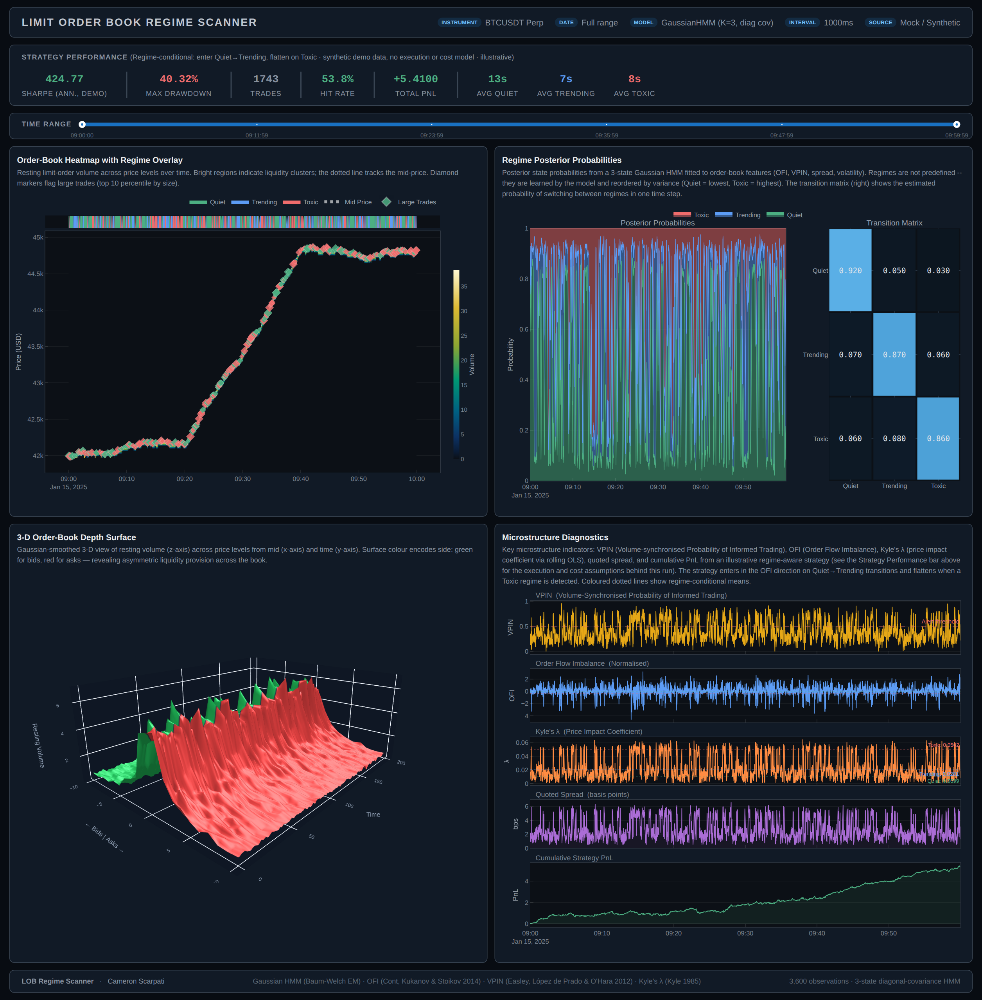

<div align="center">

# LOB Regime Scanner

### Hidden Markov Model Regime Detection for Cryptocurrency Order Books

[](https://python.org)
[](https://isocpp.org)
[](LICENSE)
[]()

*A learning project exploring latent market microstructure regimes in Level 2*
*order book data using Gaussian HMMs, microstructure features (OFI, VPIN, Kyle's*
*&lambda;), and an interactive four-panel Plotly Dash dashboard. Exploratory, not a*
*production trading signal.*

---

**[Methodology](docs/methodology.md)** &middot; **[Results](docs/results.md)** &middot; **[Notebooks](#-notebooks)** &middot; **[Quick Start](#-quick-start)**

</div>

<br>

<p align="center">
  
</p>

<p align="center"><i>
  Four-panel interactive dashboard: Bookmap-style LOB heatmap with regime overlay,
  HMM state probabilities, 3D depth surface, and toxicity diagnostics (VPIN, OFI, spread, PnL).
</i></p>

<br>

## Overview

An end-to-end pipeline, built as a learning project, that infers **hidden regimes** from noisy order book signals. The core flow:

```
Tardis L2 Snapshots ──▸ 30+ Microstructure Features ──▸ Gaussian HMM ──▸ Regime Detection ──▸ Dashboard
   (25 levels/side)       (OFI, VPIN, Kyle's λ,          (Baum-Welch       (Viterbi path +       (4 synced
    100ms sampling)        spread, vol, autocorr)          EM fitting)        posteriors)           panels)
```

The model separates the data into **three hidden states**, which I label Quiet, Trending, and Toxic by ordering them on variance. On the synthetic and sample data used here they show different volatility and liquidity characteristics. The labels are interpretive, and the separation has not been validated on real market data.

**Author:** Cameron Scarpati

<br>

## What the Model Produces

After fitting, the three states sort cleanly by variance, and on the synthetic and sample data used here they line up with an intuitive reading of the order book:

- **Quiet** is the lowest-variance state: tighter spreads, balanced order flow, near-zero return autocorrelation.
- **Trending** sits in the middle: directional order flow imbalance and positive short-horizon return autocorrelation, a momentum signature.
- **Toxic** is the highest-variance state: wider spreads, elevated VPIN, and negative return autocorrelation, a mean-reversion signature.

The learned transition matrix is strongly diagonal, so each state tends to persist rather than flip every step. A simple regime-conditional rule (enter on Quiet to Trending in the order-flow direction, flatten on Toxic) is included to visualize how the regimes behave over time.

These are qualitative observations on synthetic and sample data, not validated results. Please read **[Scope and Limitations](#scope-and-limitations)** before reading anything quantitative into them.

<br>

## Scope and Limitations

This is a personal learning project for getting hands-on with Hidden Markov Models and order book microstructure. It is exploratory rather than a production trading signal. Several early methodological weaknesses (global-scaler lookahead, fully in-sample evaluation, cost-free same-bar backtesting) have since been fixed, and the remaining limitations are stated plainly so nothing here is mistaken for a validated result:

- **No real-market validation.** The regime behavior shown above comes from synthetic and free sample data. None of it has been validated at scale on real market data, and the regime labels (Quiet/Trending/Toxic) remain an interpretive reading.
- **Walk-forward split, but a short one.** The default pipeline fits the HMM (and its feature scaler) on the first 70% of the data only and reports headline backtest statistics on the held-out 30%. That makes the numbers out-of-sample rather than in-sample, but the sample itself is short (single instrument, limited dates), so out-of-sample here still does not mean robust.
- **Standardization is causal in the default pipeline.** The HMM's `StandardScaler` is fit on the train segment only, and feature NaN handling forward-fills without back-filling, so held-out rows are never scaled with future statistics. The legacy fully in-sample mode (`train_frac=None`) still uses a full-sample scaler.
- **Backtest is more realistic, still illustrative.** Execution is next-bar (a signal never earns the bar it fires on) and results are net of configurable taker fees and slippage (default 6 bps per side), with gross figures reported alongside. It still models fills naively (full fill at the next mid, no queue position, no market impact) and exists to visualize regime behavior, not to demonstrate a tradeable edge.
- **Two OFI formulations.** Both the simple volume-delta proxy and the canonical price-conditioned formulation of Cont, Kukanov & Stoikov (2014) are implemented; the HMM uses the canonical one, and the proxy is kept for comparison.
- **Curated feature subset, diagonal covariance.** The pipeline computes roughly 30 candidate features but feeds a curated subset of 8 to the HMM, fit with diagonal covariance, to keep the parameter count manageable.
- **C++ engine is optional; throughput is measurable, not guaranteed.** A reproducible benchmark (`make bench`) is included. On a sample cloud VM it processed ~7M synthetic updates/sec through the C++ batch path and ~3.5M/sec through per-call Python bindings, single-threaded. Numbers are hardware-dependent and synthetic-workload measurements, not a validated performance claim.

<br>

## Architecture

```
┌──────────────────────────────────────────────────────────────────────────────────────┐
│                              LOB REGIME SCANNER                                      │
├────────────────────┬────────────────────┬──────────────────┬─────────────────────────┤
│                    │                    │                  │                         │
│   DATA LAYER       │   FEATURE ENGINE   │   HMM ENGINE     │   DASHBOARD             │
│                    │                    │                  │                         │
│  Tardis.dev        │  OFI (depth 1,5,10)│  Gaussian HMM    │  ┌──────┬──────-┐       │
│  Direct HTTP       │  VPIN (flowrisk)   │  3-state (BIC)   │  │Book- │Regime │       │
│  40+ exchanges     │  Kyle's λ (OLS)    │                  │  │map   │Probs  │       │
│  Free 1st/mo       │  Spread dynamics   │  Baum-Welch EM   │  │Heat- │Stacked│       │
│                    │  Book imbalance    │  (200 iter max)  │  │map   │Area   │       │
│  book_snapshot_25  │  Realized vol (4x) │                  │  ├──────┼───────┤       │
│  100ms subsampling │  Ret autocorr (10) │  Viterbi decode  │  │3D    │Toxi-  │       │
│                    │  Trade aggression  │  Forward-backward│  │Depth │city   │       │
│  C++ LOB Engine    │  Cancel ratio      │  posteriors      │  │Surf. │Diag.  │       │
│  (pybind11, opt.)  │                    │                  │  └──────┴───────┘       │
│  high-throughput   │  30+ features      │  BIC/AIC model   │  Synchronized panels    │
│                    │  Rolling z-score   │  selection       │  Crosshair + slider     │
│                    │                    │                  │                         │
└────────────────────┴────────────────────┴──────────────────┴─────────────────────────┘
```

<br>

## Tech Stack

| Layer | Technology | Purpose |
|-------|-----------|---------|
| **Core** | Python 3.11+, NumPy, Pandas | Feature computation, data pipeline |
| **Performance** | C++17, pybind11 | LOB reconstruction engine (optional, benchmark via `make bench`) |
| **Statistics** | hmmlearn, scikit-learn, flowrisk | Gaussian HMM, VPIN computation |
| **Visualization** | Plotly, Dash, Dash Mantine | Interactive 4-panel dashboard |
| **Data** | Tardis.dev (direct HTTP) | Tick-level L2 snapshots, 40+ exchanges |
| **Testing** | pytest (186 tests) | Unit tests across all modules |

<br>

## Quick Start

```bash
# Clone & setup
git clone https://github.com/CameronScarpati/lob-regime-scanner.git
cd lob-regime-scanner
make install-dev
source .venv/bin/activate

# Launch with synthetic data (no download needed)
python -m dashboard.app --demo

# Or download free sample data (1st of any month, no API key)
python data/download.py --symbol BTCUSDT --start 2024-01-01 --end 2024-01-01
python -m dashboard.app --symbol BTCUSDT --start 2024-01-01 --end 2024-01-01
```

<br>

## Downloading Data

Data is sourced from [Tardis.dev](https://tardis.dev) — professional-grade tick-level order book data for 40+ crypto exchanges. Free sample data for the **1st of each month** is available without an API key.

```bash
# Free sample data (no API key needed)
python data/download.py --symbol BTCUSDT --start 2024-01-01 --end 2024-01-01

# Multiple free months
python data/download.py --symbol BTCUSDT --start 2024-01-01 --end 2024-03-01

# Full API access (any date, requires paid key)
python data/download.py --symbol BTCUSDT --start 2024-06-15 --end 2024-06-21 \
  --tardis-api-key YOUR_KEY
```

<details>
<summary><b>Download Options &amp; Supported Exchanges</b></summary>
<br>

```bash
python data/download.py [OPTIONS]

  --symbol TEXT          Trading pair (default: BTCUSDT)
  --start DATE          Start date YYYY-MM-DD (required)
  --end DATE            End date YYYY-MM-DD (required)
  --exchange NAME       Exchange source (default: bybit)
  --data-type TYPE      Tardis data type (default: book_snapshot_25)
  --output-dir PATH     Output directory (default: data/raw/)
  --tardis-api-key KEY  Tardis.dev API key (or set TARDIS_API_KEY env var)
```

| Exchange | `--exchange` | Description |
|----------|:--------:|-------------|
| Bybit | `bybit` | Bybit derivatives (default) |
| Binance Futures | `binance` | Binance USD-M Futures |
| Binance Spot | `binance-spot` | Binance spot market |
| OKX | `okx` | OKX perpetual swaps |
| Deribit | `deribit` | Deribit options/futures |

</details>

<br>

## Dashboard

```bash
python -m dashboard.app [OPTIONS]

  --symbol TEXT        Trading pair (default: BTCUSDT)
  --start DATE         Start date (e.g. 2024-01-01)
  --end DATE           End date (e.g. 2024-01-01)
  --sample-interval N  Snapshot subsampling in ms (default: 100)
  --demo               Use synthetic mock data
  --host HOST          Bind address (default: 0.0.0.0)
  --port PORT          Port (default: 8050)
  --debug              Enable Dash debug mode
```

The `--sample-interval` flag controls temporal resolution. Tardis `book_snapshot_25` files contain a snapshot on every book change (potentially millions per day). The default 100ms interval captures microstructure dynamics while keeping memory usage reasonable (~864k snapshots/day). Use `10` for near-tick-level resolution or `1000` for faster loading on large date ranges.

<br>

## Project Structure

```
lob-regime-scanner/
│
├── src/                           Core library
│   ├── data_loader.py                 Tardis CSV parser + snapshot loader
│   ├── book_reconstructor.py          LOB reconstruction (C++ accelerated)
│   ├── features.py                    OFI, VPIN, Kyle's λ — 30+ features
│   ├── hmm_model.py                   Gaussian HMM regime detection
│   ├── backtest.py                    Regime-conditional strategy validation
│   └── cpp/                           C++17 LOB engine (pybind11)
│       ├── lob_engine.hpp/cpp             Sparse order book (std::map)
│       └── bindings.cpp                   Python bindings
│
├── dashboard/                     Plotly Dash app — 4 synchronized panels
│   ├── app.py                         Main app + CLI entry point
│   ├── pipeline.py                    End-to-end data → model → viz
│   ├── callbacks.py                   Dash interactivity callbacks
│   └── components/                    Visualization panels
│       ├── heatmap.py                     Bookmap-style LOB heatmap
│       ├── regime_probs.py                Regime probability areas
│       ├── depth_surface.py               3D order book surface
│       └── diagnostics.py                 VPIN, OFI, spread, PnL
│
├── data/                          Data acquisition
│   ├── download.py                    Tardis.dev HTTP downloader
│   └── generate_realistic.py          Synthetic data generator
│
├── notebooks/                     Analysis notebooks (4)
├── tests/                         pytest suite (186 tests)
├── docs/                          Methodology + results writeups
└── pyproject.toml                 Dependencies & package config
```

<br>

## Notebooks

| # | Notebook | Description |
|:-:|----------|-------------|
| 1 | [Data Exploration](notebooks/01_data_exploration.ipynb) | Raw L2 data statistics, order book shape analysis, spread distributions |
| 2 | [Feature Engineering](notebooks/02_feature_engineering.ipynb) | Feature distributions, correlations, OFI/VPIN time series |
| 3 | [HMM Fitting](notebooks/03_hmm_fitting.ipynb) | BIC/AIC model selection, EM convergence, state interpretation |
| 4 | [Regime Analysis](notebooks/04_regime_analysis.ipynb) | Regime-conditional statistics, transition dynamics, backtest results |

<br>

## Methodology

> For the full mathematical formulation, see [docs/methodology.md](docs/methodology.md).

The pipeline computes roughly **30 candidate microstructure features** from Level 2 snapshots, feeds a curated subset to a **Gaussian Hidden Markov Model**, and decodes regimes via the **Viterbi algorithm**:

**Feature Engineering** — order flow imbalance in two formulations (a simple multi-level volume-delta proxy and the canonical price-conditioned Cont, Kukanov & Stoikov (2014) version, which the HMM uses), VPIN (Easley, L&oacute;pez de Prado & O'Hara, 2012), Kyle's &lambda; via rolling OLS, book imbalance, realized volatility at 4 horizons, return autocorrelation at 10 lags, spread dynamics, trade aggression, and cancellation ratio. NaN handling is forward-fill only (no backward fill), so no feature row draws on future data.

**HMM Regime Detection** — a 3-state Gaussian HMM, fit via Baum-Welch EM (up to 200 iterations) with diagonal covariance in the default pipeline (full covariance is also supported). The default pipeline is walk-forward: the model and its `StandardScaler` are fit on the first 70% of the series only, then decode the full series, so held-out rows are never scaled with future statistics. States are auto-sorted by covariance trace (a volatility proxy) for deterministic labeling. A BIC/AIC sweep over K &isin; {2, 3, 4, 5} is implemented; the default uses K = 3, chosen for interpretability.

**Backtest** — a regime-conditional rule (enter on Quiet to Trending in the OFI direction, flatten on Toxic) with next-bar execution, taker fees and slippage (defaults: 5.5 + 0.5 bps per side), Sharpe annualized from the actual bar interval, and drawdown reported as a fraction of peak equity. Headline statistics come from the held-out segment, net of costs, with in-sample and gross figures reported alongside. It exists to visualize regime behavior, not to demonstrate a tradeable edge.

<br>

## Development

```bash
make install-dev       # Create venv + install all dependencies
make test              # Run pytest suite (186 tests)
make lint              # Run ruff linter
make format            # Auto-format with ruff
```

<br>

## References

<table>
<tr><td>1</td><td>Cont, R., Kukanov, A., Stoikov, S. (2014). "The Price Impact of Order Book Events." <i>Journal of Financial Econometrics</i>, 12(1), 47–88.</td></tr>
<tr><td>2</td><td>Easley, D., López de Prado, M., O'Hara, M. (2012). "Flow Toxicity and Liquidity in a High Frequency World." <i>Review of Financial Studies</i>, 25(5), 1457–1493.</td></tr>
<tr><td>3</td><td>Hamilton, J.D. (1989). "A New Approach to the Economic Analysis of Nonstationary Time Series and the Business Cycle." <i>Econometrica</i>, 57(2), 357–384.</td></tr>
<tr><td>4</td><td>Kyle, A.S. (1985). "Continuous Auctions and Insider Trading." <i>Econometrica</i>, 53(6), 1315–1335.</td></tr>
</table>

<br>

<div align="center">

---

*Built with Python, C++, and quantitative curiosity.*

</div>
